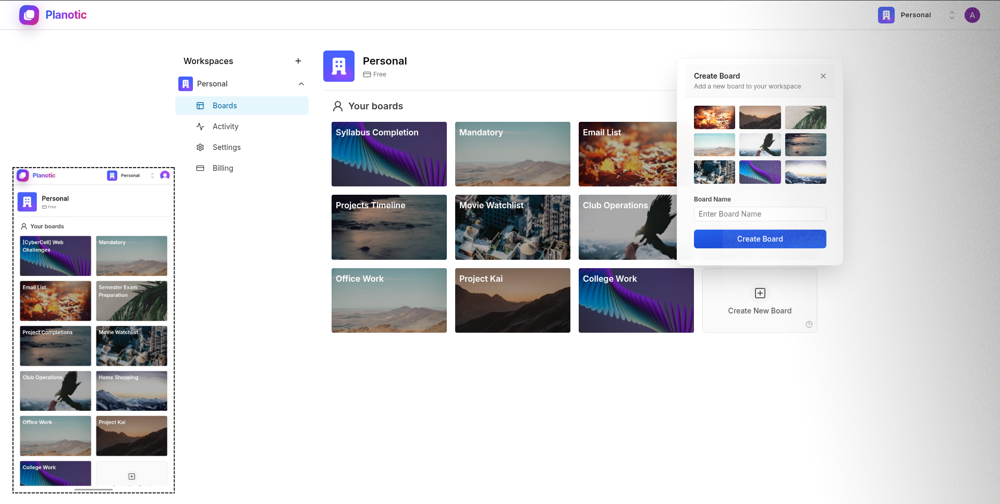

# 🚀 Planotic

### Turn Chaos Into Clarity!

A modern task management platform for teams and individuals.

## About

Planotic is a Kanban-style task management application that helps teams organize projects, collaborate effectively, and boost productivity. Built with modern web technologies for a seamless experience across all devices.

## Platform Features

- **📋 Kanban Boards** - Visual project organization with drag-and-drop functionality
- **📝 Task Cards** - Detailed task management with descriptions and activities  
- **📊 List Management** - Customizable workflow columns and organization
- **👥 Team Collaboration** - Organization-based workspaces and user management
- **🔐 Secure Authentication** - User accounts and role-based access control
- **📱 Responsive Design** - Optimized for desktop, tablet, and mobile devices

## Tech Stack

- **Frontend**: Next.js 14, React 18, TypeScript
- **Styling**: Tailwind CSS, Radix UI Components
- **Backend**: Next.js API Routes, Server Actions
- **Database**: Prisma ORM with PostgreSQL
- **Authentication**: Clerk
- **State Management**: Zustand, React Query
- **Validation**: Zod Schema Validation
